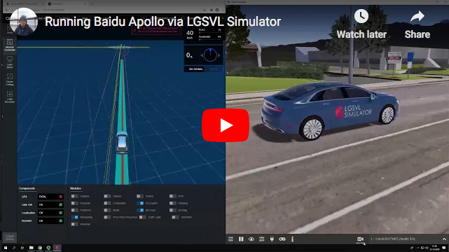
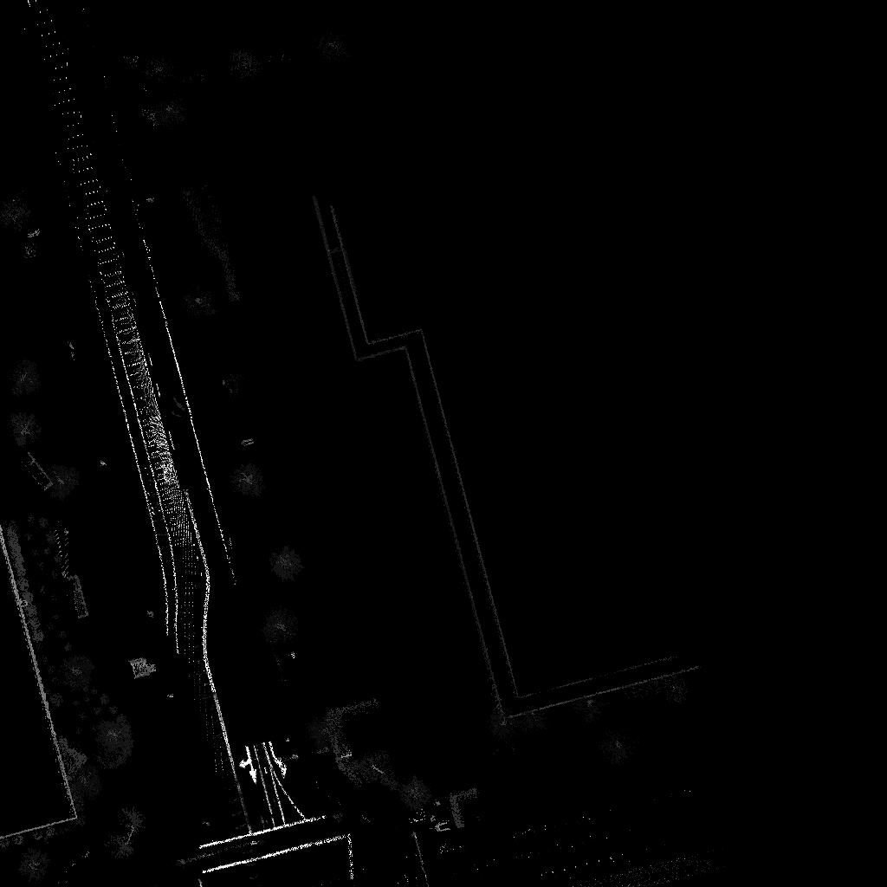

#Autonomous Vehicle Project 2020

## General Information
My personal repository contains what I'm learning through this course [Autonomous Vehicles Project Autumn 2020](https://courses.cs.ut.ee/2020/AutVehProj/fall/Main/Track-ADL) from the University of Tartu

## Software Stack
- Baidu Apollo v5.5+ (`git clone` from [here](https://github.com/ApolloAuto/apollo))
- LGSVL Simulator (documentation from [here](https://www.lgsvlsimulator.com/docs/))
- Docker Engine (documentation from [here](https://docs.docker.com/engine/install/ubuntu/))

## Prerequisites
- Ubuntu 16.04 or later (Ubuntu 18.04 is preferred)
- Nvidia graphics card (required for Perception)
 - Nvidia proprietary driver (>=410.48) must be installed
- Docker 19.03+

## Installation
Following tutorial from [Apollo github page](https://github.com/ApolloAuto/apollo/blob/master/docs/specs/prerequisite_software_installation_guide.md)

### NVIDIA GPU Driver
```
sudo apt-get update
sudo apt-add-repository multiverse
sudo apt-get update
sudo apt-get install nvidia-driver-440
```
Type `nvidia=smi` to check if NVIDIA GPU works fine

### Docker Engine
- Apollo 6.0+ requires Docker 19.03+ to work properly
- Follow this [tutorial](https://docs.docker.com/engine/install/ubuntu/)

### NVIDIA Container Toolkit
```
distribution=$(. /etc/os-release;echo $ID$VERSION_ID)
curl -s -L https://nvidia.github.io/nvidia-docker/gpgkey | sudo apt-key add -
curl -s -L https://nvidia.github.io/nvidia-docker/$distribution/nvidia-docker.list | sudo tee /etc/apt/sources.list.d/nvidia-docker.list
sudo apt-get -y update
sudo apt-get install -y nvidia-container-toolkit
```
Restart Docker daemon for the changes above to take effect.
`sudo systemctl restart docker`

## Apollo Setup
- clone the repository `git clone https://github.com/ApolloAuto/apollo`
- launch the container and mount a few volumes `./docker/scripts/dev_start.sh`
- enter the container `./docker/scripts/dev_into.sh`
- build apollo `./apollo.sh build_opt_gpu` (optimized, not debug, with GPU support)

**NOTE** The Apollo build may fail on machines with less than 1GB of RAM per CPU core due to aggressive parallelization in the build, as discussed in [Apollo issue 7719](https://github.com/ApolloAuto/apollo/issues/7719).


## Running Apollo via LGSVL Simulator
- enter the container from Apollo root folder `./docker/scripts/dev_into.sh`
- activate dreamview `./scripts/bootstrap_lgsvl.sh`
- activate the bridge `./scripts/bridge.sh`
- more instructions from [here](https://www.lgsvlsimulator.com/docs/apollo-master-instructions/)

### Sample Demonstration Video
[](https://www.youtube.com/watch?v=adaWOz_d0tM)


## Record LiDAR Point Cloud
- Make sure these 3 channels are working (green lit)
    - `/apollo/sensor/lidar128/compensator/PointCloud2`
    - `/apollo/sensor/gnss/odometry`
    - `/apollo/localization/pose`
- run this command `cyber_recorder record -c /apollo/sensor/lidar128/compensator/PointCloud2 /apollo/sensor/gnss/odometry /apollo/localization/pose`
- Press `CTLR+C` to stop the recording
- The recording file will available on root path /apollo, for example file name will be like this `20201122140558.record.00000`

## Generate Local Map
[Reference by Tanya Shtym](https://colab.research.google.com/drive/1TGqWGqNEHVLnWdxedXkjOvEkZCnSgVlu?usp=sharing#scrollTo=SUNAvHFrm5eu)
### Method 1
- Before generating, make sure we already have recording file from `cyber_recorder` command
- Run this command: `./scripts/msf_simple_map_creator.sh /apollo/recording/ /apollo/modules/calibration/data/Lincoln2017MKZ_LGSVL/velodyne_params/velodyne128_novatel_extrinsics.yaml 10 outmap` (assuming `/apollo/recording/` is the path where record file located)
- Image output example


### Method 2
#### Extract Point Cloud
- Extract Point Cloud from recording file `scripts/msf_record_parser.sh [RECORDINGS_FOLDER] [OUTPUT_FOLDER]`
- For example: `./scripts/msf_record_parser.sh /apollo/20201122140558.record/ /apollo/20201122140558.record/record_parser/`
- Point clouds output in `/apollo/20201122140558.record/record_parser/`

#### Interpolate Poses
- Pose interpolation fixes the pose file, such that the location and timestamps of the locations match LiDAR scans.
- Command: `./scripts/msf_poses_interpolator.sh [input_poses_path] [ref_timestamps_path] [extrinsic_path] [output_poses_path]`
- Example: `./scripts/msf_poses_interpolation.sh /apollo/20201122140558.record/record_parser/00000/pcd/fusion_loc.tx
t /apollo/20201122140558.record/record_parser/00000/pcd/pcd_timestamp.txt /apollo/modules/calibration/data/Lincoln2017MKZ_LGSVL/velodyne_params/velodyne128_novatel_extrinsics.yaml /apollo/20201122140558.record/record_parser/00000/pcd/odometry_loc.txt`
- Repeat it for `/apollo/recording/record_parser/00001`, `/apollo/recording/record_parser/00002`. etc

#### Run `msf_local_map_creator.sh`
- Command `./scripts/msf_local_map_creator.sh [pcd folder] [pose file] [zone id] [map folder]`
- Example `./scripts/msf_local_map_creator.sh /apollo/20201122140558.record/record_parser/00000/pcd/ /apollo/20201122140558.record/record_parser/00000/pcd/odometry_loc.txt 10 /apollo/20201122140558.record/outmap/`
- Repeate it for `/apollo/recording/record_parser/00001`, `/apollo/recording/record_parser/00002`. etc
- Output in `/apollo/20201122140558.record/outmap/lossy_map`

## Record Waypoints and Replay it
[Reference by Tanya Shtym](https://colab.research.google.com/drive/1wx1iLsYP5zkYEumoHivIx9jw4nC47wUl?usp=sharing#scrollTo=jQZpJC19EKFz)
### Record
- Run this two commands
`./scripts/rtk_recorder.sh setup` and `./scripts/rtk_recorder.sh start`
- Make sure `./scripts/bridge.sh` is connected
- Run car in simulator to record waypoints
- Finish recording by pressing `Ctrl + C`
- Recorded waypoint are stored in the `apollo/data/log/garage.csv`

### Replay the record
- Put the car into initial location, by press `F12` in simulator
- Run `./scripts/rtk_player.sh start`

## Reference(s)
- [Credits by Tanya Shtym](https://docs.google.com/document/d/1uJSoimyLXUrd1_YRGwssnEyQK-kX_gf8jgZ1xUgKAo0/edit)