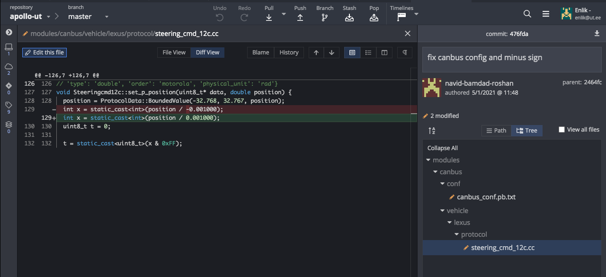

# Testing Apollo on Lexus Car

## General Information
Contains only some changed required modules from [official repo of Apollo](https://github.com/ApolloAuto/apollo)


## Jan 5, 2021 - Testing on Raadi (Ex Military Field in Tartu)
### Setup
- Enter docker container
- Run `./apollo.sh build_opt_gpu canbus`

- Run `./scripts/rtk_player.sh setup` and `./scripts/canbus.sh`

- Run `./scripts/canbus_teleop.sh`


### Control Module
- Run `cyber_launch stop /apollo/modules/control/launch/control.launch`


- Start Control module `./scripts/control.sh`

### RTK Player and Recorder
- Setup RTK Player `./scripts/rtk_player.sh setup`

- Cyber Node List `cyber_node list`

- Cyber Launch start control module

- RTK Recorder `./scripts/rtk_recorder.sh start`

- Start RTK Player `./scripts/rtk_player.sh start`

### Stopping all running modules
- GPS + canbus + localization + control modules


### Canbus
- cyber launch canbus

- cyber launch start localization

- cyber launch gnss


### Misc
- Pad Terminal `./bazel-bin/modules/control/tools/pad_terminal`


- fix canbus config and minus sign



### Sample Demo Screenshot


## Dec 8, 2020 Meeting
GNSS with Apollo and Lexus Car

- GNSS Config in Apollo from [here](https://github.com/ApolloAuto/apollo/blob/master/modules/drivers/gnss/conf/gnss_conf.pb.txt)
	- This is California, US `proj4_text: "+proj=utm +zone=10 +ellps=WGS84 +towgs84=0,0,0,0,0,0,0 +units=m +no_defs"`
	- Change that from this [reference](https://epsg.io/3301.proj4)
	- Another one `gpsbin_folder: "/apollo/data/gpsbin"`
	- `# login_commands: "UNLOGALL THISPORT\r\n"`
		- it means: *don't send me any information, stop logging!*
	- asd
- Other: [config.proto](https://github.com/ApolloAuto/apollo/blob/master/modules/drivers/gnss/proto/config.proto)
- [Novatel PwrPak7 GNSS](https://www.google.com/search?q=Novatel+ProPack7+GNSS&client=firefox-b-d&sxsrf=ALeKk03in499f2kpb35bHGKDpPW00ZoCUg:1607436736974&source=lnms&tbm=isch&sa=X&ved=2ahUKEwiA3NK9yL7tAhXpsaQKHTpWCaYQ_AUoAXoECBEQAw&biw=1280&bih=593#imgrc=py1hmDD_v_ZIvM)
	- Apollo installation [guide](https://github.com/ApolloAuto/apollo/blob/master/docs/specs/Navigation/PwrPak7_Installation_Guide.md) 
	- 
- asda  
- //TODO
	- Find utm zone that related to Estonia
	- [ESPG:3001 Estonia](https://epsg.io/3301) 
	- Novatel logs understanding
		- [link 1](https://docs.novatel.com/OEM7/Content/SPAN_Logs/OEM7_SPAN_Logs.htm)
		-
	- Figure out all the config 	
		https://docs.novatel.com/OEM7/Content/Commands/LOG.htm


``` 
# notice: only for debug, won't configure device through driver online!!!
# login_commands: "LOG COM2 GPRMC ONTIME 1.0 0.25\r\n"

# login_commands: "EVENTOUTCONTROL MARK2 ENABLE POSITIVE 999999990 10\r\n"

# login_commands: "EVENTOUTCONTROL MARK1 ENABLE POSITIVE 500000000 500000000\r\n"

# login_commands: "LOG GPGGA ONTIME 1.0\r\n" 
```


## Dec 1, 2020 Meeting
This meeting started with brief presentation about SocketCAN and how it works with AV car

- CAN bus driver
- SocketCAN
	- combination of CAN
	- implemented by Volkswagen Research
	- instead of IP map implementation, use CAN implementation
	- Code samples:
	
	```UNIX
	sudo modprobe can
	sudo modprobe can_raw
	sudo ip link set can0 type can bitrate 5000000
	sudo ip link set up can0
	```
- Other option: implmenting Kvaser client
	- Driver is ready
	- edit this configg file
- Set low-latency Linux

`sudo apt-get install -y linux-lowlatency`


## Reference(s)
- Credits to [Navid Bamdad Roshan](https://docs.google.com/document/d/19-NjgMJckhQ-rYFoHw4eI5fy8FPJ3ofTIzXevZ1Xh-0/edit?usp=sharing)